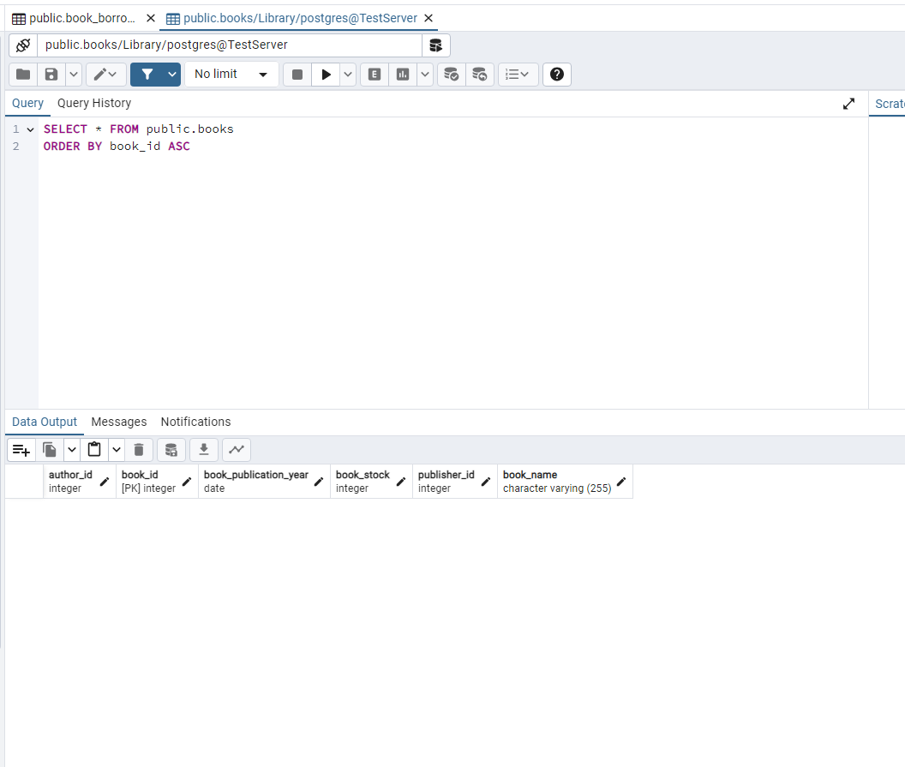
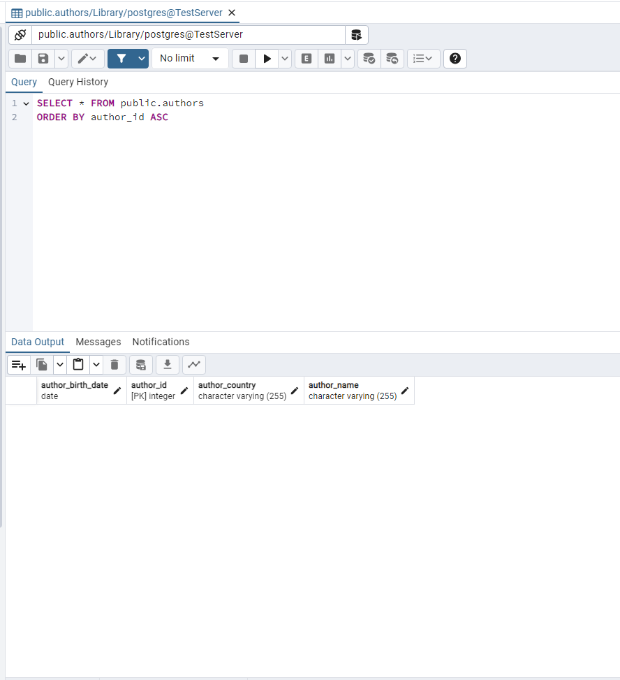
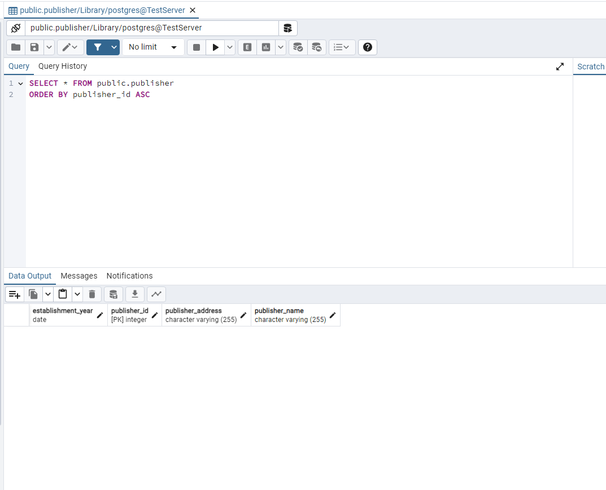
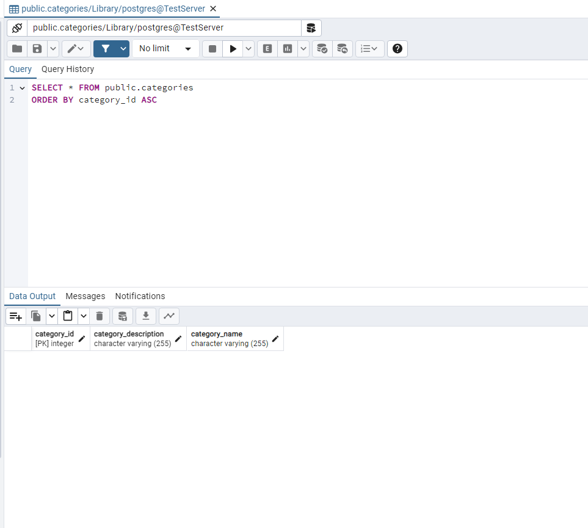
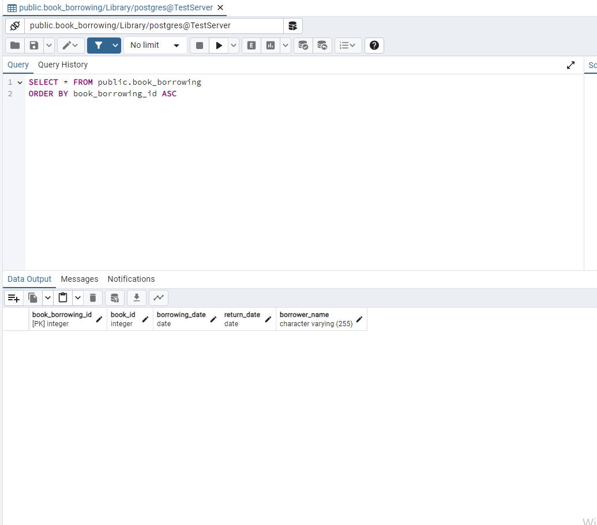
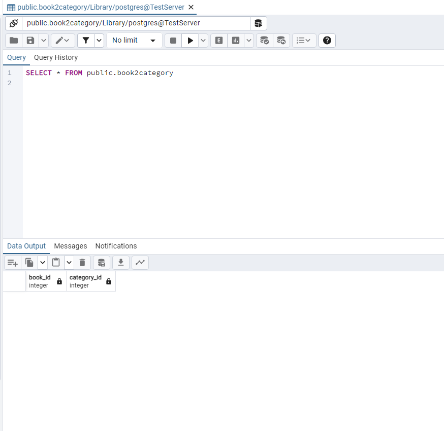

# Library Management System

This describes the project schedule management system. Allows management of books, authors, publishers and borrowing transactions.

### Requirements

- Java 
- Maven
- PostgreSQL

### Installation Steps
1. Clone the project to the computer.
2. Create a database named `Library`.
3. Open the `persistence.xml` file in the `src/main/resources` folder and enter your PostgreSQL username and password.
4. Run the `Main.java` file to run the application.

## Database Tables

### Book Table

### Author Table

### Publisher Table

### Category Table

### Book Borrowing Table

### Book2Categories Table

## Entity Relationships

In this system, the following entity relationships are defined:
- A book can have one author, an author can have more than one book (One-to-Many relationship).
- A category can have more than one book, while a book can belong to more than one category (Many-to-Many relationship).
- A book may have one publishing house, and a publishing house may have more than one book (One-to-Many relationship).
- A book can have multiple loans, but each loan can only belong to one book (One-to-Many relationship).

## Technologies
- Java
- Hibernate
- PostgreSQL
- Maven